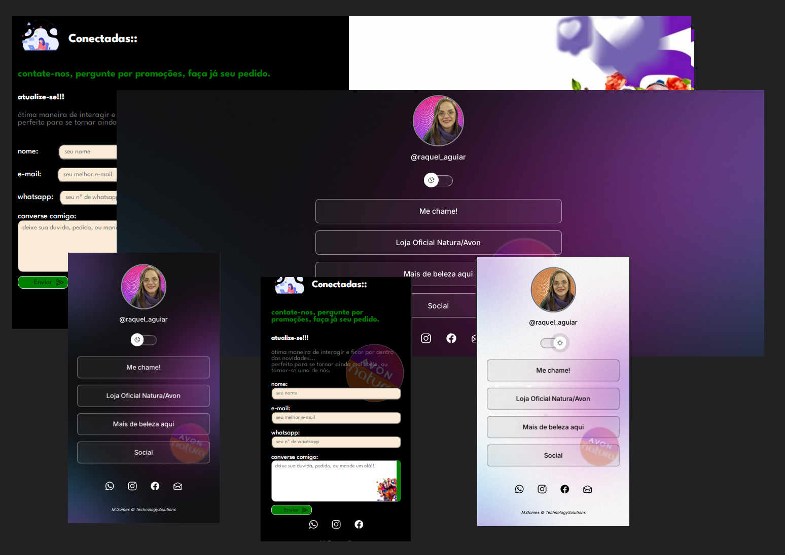

<h1 align="center"> Contact Link Tree </h1>

"Contact Link Tree" é um projeto que auxilia contatos entre pessoas de um grupo, ou sua adesão, através da concentração de links relevantes a esse tipo de grupo. Proposto à uma liderança com assuntos de cosméticos e beleza.

  <a href="#-tecnologias">Tecnologias</a>&nbsp;&nbsp;&nbsp;|&nbsp;&nbsp;&nbsp;
  <a href="#-projeto">Projeto</a>&nbsp;&nbsp;&nbsp;|&nbsp;&nbsp;&nbsp;
  <a href="#-layout">Layout</a>&nbsp;&nbsp;&nbsp;|&nbsp;&nbsp;&nbsp;
  <a href="#memo-licença">Considerações</a>

  

 

  

## 🚀 Tecnologias

Esse projeto foi desenvolvido com as seguintes tecnologias:

- HTML e CSS
- JavaScript
- Git e Github
- FormSubmit

## 💻 Projeto

Contact Link Tree introduz uma lista de links que favorecem acesso a uma equipe de lidença. 
Bem como acesso a páginas relacionadas a beleza. 
Podendo ter dados enviados para um e-mail cadastrado através da ferramenta 'formSubmit'   

-[Visite o projeto online](https://celo-gomes.github.io/powerbeauty)

## 🔖 Layout

Layout da página principal desenvolvido com base nos design oferecido pela escola Rocketseat, já que temos o tema aproximado, com adição de elementos gráficos. 
Pagina de social, contento formulário para identificação e esclarecimento de duvidas e conversas relacionadas ao grupo de interesse. 
O formulário será entregue ao lider através da ferramenta formsubmit.co. 
Responsivo a telas mobile.

## :memo: Considerações.

Página criada para avaliação de idéias, tendo como protagonista uma das mulheres mais inteligentes e bonitas desse mundo, Sr. Raquel Aguiar. 
Esse projeto está sob a licença MIT. 

---

Feito com ♥ by M. Gomes :wave: [Visite no GitHub!](https://github.com/celo-gomes)